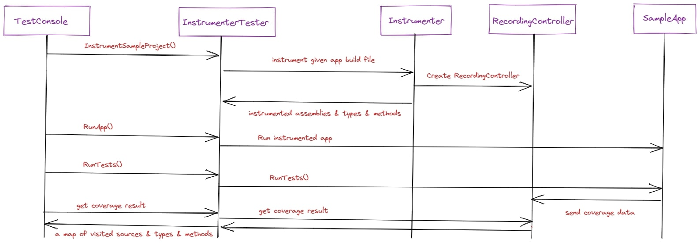

# SG.CodeCoverage
A code coverage library, used for *Test Impact Analysis* (or *Continuous Testing*) in our internal testing framework, as a replacement for vstest's inefficient data collectors.

## How does it work?

SG Coverage works by weaving IL codes into project's assemblies using its `Instrumenter` type in the `SG.CodeCoverage` project. It injects a `AddHit(int typeId, int methodId)` method call that counts number of times the method visited, and creates a json map file that maps id of assemblies, types and their methods to their file paths, during this process.

The `AddHit(int, int)` method resides in the `SG.CodeCoverage.Recorder` project, which is an auto generated assembly for each instrumentation phase (inspired by [AltCover](https://github.com/SteveGilham/altcover), [Coverlet](https://github.com/tonerdo/coverlet) and [MiniCover](https://github.com/lucaslorentz/minicover)) and holds the total number of types instrumented and an in-memory visit counter.

## Steps to produce coverage results

1. Instrument assemblies using `Instrumenter` class. This process outputs a `json` map file.
2. When any method in the project is called, instrumented assemblies make sure that the `RecordingControllerServer` is running and collecting data, and then sends the hit records to the server.
3. After running each test, you can call `RecorderControllerClient.SaveHitsAndReset(string outputPath)`. This will send a request to server to save the visited types and methods as a binary file like `hits.test1.bin`, then resets the counter.
4. After collecting test hits, you can find the visited files by merging the `json` map file and the binary hit file. This can be easily done using `DataCollector.GetVisitedFiles` method which does this task.

## Summary
This is not exactly a sequence diagram, but helps you get the idea, And as they say, "a picture worth a thousand words":

